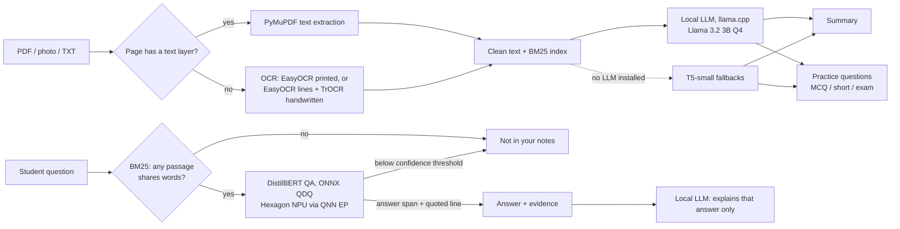

# StudyFlow Edge

**A private, offline study assistant for students, built for Snapdragon-powered HP AI PCs.**

Drop in a lecture PDF, a photo of the whiteboard or a page of handwritten notes. StudyFlow Edge reads it, writes a revision summary, makes multiple-choice, short-answer or university-exam (2- and 5-mark) questions, and answers your questions with a line copied from your notes — all on the laptop. No account, no internet after setup, no notes uploaded anywhere.

Submitted to the **Qualcomm Snapdragon® AI Lab Build & Present Challenge 2026**.

<!-- Add docs/screenshot.png from a real run with real models, then:  -->

---

## Contents

1. [Why this matters](#why-this-matters)
2. [What it does](#what-it-does)
3. [Quick start](#quick-start)
4. [How it works](#how-it-works)
5. [Grounded answers](#grounded-answers)
6. [Running on the NPU](#running-on-the-npu)
7. [Measured results](#measured-results)
8. [Tests](#tests)
9. [Privacy and security](#privacy-and-security)
10. [Accessibility](#accessibility)
11. [Configuration](#configuration)
12. [Troubleshooting](#troubleshooting)
13. [Project structure](#project-structure)
14. [HTTP API](#http-api)
15. [Limitations and roadmap](#limitations-and-roadmap)
16. [License and credits](#license-and-credits)

---

## Why this matters

Students in India often study where connectivity is poor or metered, and many don't want their notes, assignments or handwriting sent to cloud AI services. Cloud tools also stop working on a train, in a hostel with bad Wi-Fi, or when free quotas run out. An HP AI PC with a Snapdragon X-series processor has a Hexagon NPU built for exactly this kind of always-available, low-power local AI.

| Problem | What StudyFlow Edge does |
|---|---|
| Notes are scattered across PDFs, slides, photos and handwriting | One drop zone; typed PDFs are read instantly, scanned pages and handwriting go through on-device OCR |
| Generic AI quizzes don't match Indian exam patterns | Exam mode writes 2-mark and 5-mark questions with model-answer points |
| Chatbots invent answers | Every answer is a phrase copied from your notes, shown with the line it came from. The local LLM only explains that answer and never supplies its own. If the notes don't cover a question, the app says so |
| Privacy and connectivity | Everything runs locally; uploads are deleted after reading |

---

## What it does

- **Reads your material.** Typed PDFs, scanned PDFs, photos of printed pages, handwritten notes, and plain text or Markdown files.
- **Writes a revision summary** of the whole document, not just its first page.
- **Generates practice questions** in three styles: multiple choice, short answer, and university-exam questions with marks and model-answer points.
- **Answers questions from your notes**, quoting the line each answer came from, and says so when the notes don't cover the question.
- **Exports flashcards** as a CSV that imports into Anki or opens in Excel.
- **Reads aloud** summaries and answers with the voices built into Windows.
- **Runs offline** once models are installed, on the NPU where available and on the CPU everywhere else.

---

## Quick start

### Option A — install the packaged app (Windows, HP Snapdragon PC)

1. Download `StudyFlowEdge-windows-*.zip` from the **Releases** page and unzip it.
2. Run `StudyFlowEdge.exe`. Models are bundled, so no internet is needed.
3. Click **Try sample notes** to see it work immediately.

The app also runs on any Windows laptop without an NPU; the QA model then uses the CPU and the header shows "Answers on CPU".

### Option B — run from source

```bash
git clone <this repo> && cd studyflow-edge
python -m venv .venv
.venv\Scripts\activate                 # macOS/Linux: source .venv/bin/activate
pip install -r requirements.txt

python -m unittest discover -s tests -t .    # 50 tests, no model weights needed
python scripts/download_models.py            # once, needs internet (~1 GB)

python app/desktop.py                        # native window
# or: python app/main.py  ->  http://127.0.0.1:5000
```

For the local LLM (much better summaries and questions) and handwriting support:

```bash
pip install -r requirements-optional.txt
python scripts/download_models.py --llm llama3.2-3b     # ~2 GB (llama3.2-1b on 8 GB RAM)
python scripts/download_models.py --handwriting         # TrOCR, only for handwritten notes
```

Without the LLM the app still works, using compact T5 models for summaries and questions.

On Snapdragon, use **native ARM64 Python**. Check with:

```bash
python -c "import sysconfig; print(sysconfig.get_platform())"   # want: win-arm64
```

### First run

The first start takes 30–60 seconds while models load in the background. Then:

1. Click **Try sample notes**, or drop in a PDF or photo.
2. Read the summary and the practice questions; switch style with the dropdown.
3. Ask a question in the box (press <kbd>/</kbd> to jump there).
4. Click **Export flashcards** to save a CSV.

---

## How it works



| Component | Model | Runtime on the HP Snapdragon PC |
|---|---|---|
| Question answering | `distilbert-base-uncased-distilled-squad`, exported to static-shape ONNX (384 tokens, int32 inputs) and statically quantised (uint8 weights / uint16 activations, QDQ) | **Hexagon NPU**, ONNX Runtime + QNN Execution Provider |
| Summary, questions, explanations | Llama 3.2 3B Instruct, GGUF Q4_K_M | Oryon CPU, llama.cpp |
| Printed OCR | EasyOCR (CRAFT + CRNN) | CPU |
| Handwriting OCR | EasyOCR line detection + `microsoft/trocr-small-handwritten` per line | CPU |
| Fallbacks (no LLM installed) | `t5-small`, `valhalla/t5-small-qg-hl` | CPU |

Key engineering choices:

- **Static shapes and static quantisation for the NPU.** QNN needs fixed tensor shapes and QDQ-quantised graphs, so `scripts/export_qa_onnx.py` exports a fixed 384-token graph (long notes are handled with overlapping 128-token windows) and `scripts/quantize_qa_qnn.py` uses ONNX Runtime's QNN-specific quantisation config with calibration data drawn from real notes.
- **Proof of full offload.** `scripts/check_npu.py` creates the session with CPU fallback disabled (`session.disable_cpu_ep_fallback=1`), so a successful run shows the whole graph executes on the NPU. The app's "Answers on NPU" label only shows that the QNN provider was selected; this script is the proof that every operation runs there.
- **Measured on real Snapdragon hardware in the cloud.** `scripts/aihub_profile.py` compiles the model with Qualcomm AI Hub, profiles it on a Snapdragon X Elite device, reports which compute unit each layer ran on, and can verify the on-device output matches the CPU.
- **Skip AI where it isn't needed.** Pages with a text layer bypass OCR entirely, which is the largest latency saving for lecture PDFs.
- **Bounded work, not just bounded file size.** A small PDF can hold hundreds of scanned pages, so the extractor caps pages, scanned pages (checked before any OCR starts), image megapixels and extracted text length.
- **Honest reporting.** Every answer in the UI shows which model and device produced it, and every script writes its raw results to `results/`.

---

## Grounded answers

The app's central claim is that answers come from your notes. It is enforced by the pipeline, not by asking a model to behave:

1. **Retrieval gate.** A dependency-free BM25 index picks the three most relevant passages. If no passage shares a word with the question, the app answers "not in your notes" and neither model runs.
2. **Extraction.** The QA model copies a span out of those passages. That span is always the answer shown, together with the sentence it came from.
3. **Confidence gate.** If the best span scores below `STUDYFLOW_QA_MIN_SCORE`, the app says the notes don't cover the question.
4. **Explanation only.** The local LLM is then given the verified span and its quoted line, and may only explain it. It cannot change the answer, it isn't called at all when there is no answer, and if it replies that the notes don't support the span, the explanation is dropped rather than the answer.

### Calibrating the confidence threshold

The QA model is a SQuAD 1.1 model, so it always returns some span; the threshold is what turns "best span" into "no answer". It must be measured, not guessed — especially for **near-miss** questions, which share keywords with the notes (so retrieval passes them through) but aren't answered by them.

```bash
python scripts/evaluate_qa.py --onnx models/qa/model.qdq.onnx --sweep
```

This reports, for thresholds from 0.05 to 0.90: how often answerable questions are answered correctly, and how often unanswerable ones are refused (split into near-miss and off-topic). It then suggests a value for `STUDYFLOW_QA_MIN_SCORE`.

Run the sweep on the runtime you ship, since quantised scores differ from FP32. `data/samples/qa_eval.json` holds 38 labelled questions over the sample notes (22 answerable, 12 near-miss, 4 off-topic); add 10–20 from your own notes and re-run with `--set my_eval.json` before trusting the number.

---

## Running on the NPU

```bash
pip install onnx qai-hub

python scripts/export_qa_onnx.py         # models/qa/model.onnx, verified against PyTorch
python scripts/quantize_qa_qnn.py        # models/qa/model.qdq.onnx, used automatically
python scripts/evaluate_qa.py --compare  # accuracy: PyTorch vs ONNX FP32 vs QDQ
```

On the Snapdragon PC:

```bash
pip uninstall onnxruntime && pip install onnxruntime-qnn
python scripts/check_npu.py              # NPU offload proof + NPU vs CPU latency
python scripts/benchmark.py --doc lecture.pdf --question "<a question that PDF answers>"
```

Without a Snapdragon device, profile on Qualcomm's device cloud instead:

```bash
qai-hub configure --api_token <token>
python scripts/aihub_profile.py --list-devices
python scripts/aihub_profile.py --verify
```

Every script writes a JSON file to `results/` with the machine details, so the numbers below can be traced back to a run.

---

## Measured results

> Fill these in from `results/*.json`. Every number below must come from a script run; mark anything not yet measured as "not measured".

| Measurement | Value | Source |
|---|---|---|
| QA inference, Snapdragon X Elite NPU (AI Hub profile) | _ms_ | `scripts/aihub_profile.py` |
| QA layers on NPU | _n of n_ | `scripts/aihub_profile.py` |
| QA inference, CPU (same model) | _ms_ | `scripts/check_npu.py` |
| NPU speed-up vs CPU | _×_ | `scripts/check_npu.py` |
| QA exact match / F1, FP32 vs QDQ | _EM / F1_ | `scripts/evaluate_qa.py --compare` |
| "Not in your notes" rejection rate (near-miss / off-topic) | _% / %_ | `scripts/evaluate_qa.py --onnx models/qa/model.qdq.onnx` |
| Confidence threshold used, and why | _value_ | `scripts/evaluate_qa.py --sweep` |
| End-to-end: 10-page lecture PDF | _s_ | `scripts/benchmark.py` |
| Peak memory, whole app | _MB_ | `scripts/benchmark.py` |

Test machine(s): _e.g. HP OmniBook X 14 (Snapdragon X Elite, 16 GB), or "AI Hub device cloud + x64 dev laptop"_.

---

## Tests

```bash
python -m unittest discover -s tests -t .
```

50 tests cover answer-span decoding, retrieval, chunking, LLM output parsing, grounding (the LLM can't replace an answer; off-topic questions never reach the models), input limits, evaluation metrics, the local-only request guard, cross-thread PyTorch inference, and the full API (non-English filenames, error reporting, upload deletion, export, sample notes). They use stand-in models, so they run in under a second without any weights.

Some tests deliberately trigger failures, so the run prints tracebacks and "Refused …" log lines. A pass ends with `OK`.

---

## Privacy and security

- **Nothing leaves the device.** No AI service is called at any point. Once models are installed, the app works with Wi-Fi switched off, and `config.py` forces Hugging Face libraries into offline mode when weights are already on disk.
- **Local-only server.** The server binds to `127.0.0.1` and refuses any request addressed to another host name, which blocks DNS-rebinding attacks that would otherwise let a web page read your notes. Requests that change state (upload, load sample, clear) are refused unless they come from the app's own page, so other sites and other local apps can't drive it.
- **Uploads are temporary.** Files are deleted as soon as they're read (`STUDYFLOW_KEEP_UPLOADS=1` keeps them for debugging), and "Clear notes" wipes the session from memory.
- **Single user by design.** One set of notes at a time, on one desktop. It is not a multi-user web service and has no accounts.

---

## Accessibility

- Full keyboard use: visible focus, a skip link, <kbd>/</kbd> jumps to the question box, Enter opens the file picker
- Adjustable text size (A−/A+) and light/dark themes, remembered between sessions
- Read aloud for summaries and answers using the voices built into Windows (works offline)
- Screen-reader support: live regions for progress and answers, labelled controls, `aria-expanded` on reveal buttons
- Respects "reduce motion"; layout works down to phone-width windows
- Plain-language errors that say what to do next

---

## Configuration

All settings are environment variables. On Windows use `set NAME=value` in cmd, or `$env:NAME="value"` in PowerShell.

| Variable | Default | Purpose |
|---|---|---|
| `STUDYFLOW_OCR_BACKEND` | `easyocr` | `handwriting` for TrOCR line recognition |
| `STUDYFLOW_OCR_LANGS` | `en` | EasyOCR language codes, e.g. `en,hi` |
| `STUDYFLOW_QA_RUNTIME` | `auto` | `onnx` or `torch` to force a runtime |
| `STUDYFLOW_QA_MODEL` | `distilbert-base-uncased-distilled-squad` | QA checkpoint |
| `STUDYFLOW_QA_SEQ_LEN` | `384` | Tokens per QA window (must match the exported ONNX graph) |
| `STUDYFLOW_QA_MIN_SCORE` | `0.15` | QA confidence below this means "not in your notes"; set from `evaluate_qa.py --sweep` |
| `STUDYFLOW_USE_LLM` | `1` | `0` to use only the compact models |
| `STUDYFLOW_LLM_GGUF` | first `models/llm/*.gguf` | Path to a different GGUF model |
| `STUDYFLOW_LLM_CTX` | `4096` | LLM context window (lower on 8 GB laptops) |
| `STUDYFLOW_LLM_THREADS` | `0` (auto) | CPU threads for llama.cpp |
| `STUDYFLOW_MODELS_DIR` | `models/` | Where weights are stored |
| `STUDYFLOW_DATA_DIR` | OS app-data folder | Where uploads and user data live |
| `STUDYFLOW_KEEP_UPLOADS` | `0` | Keep uploaded files after processing |
| `STUDYFLOW_MAX_UPLOAD_MB` | `50` | Largest file accepted |
| `STUDYFLOW_MAX_PDF_PAGES` | `300` | Largest PDF accepted, in pages |
| `STUDYFLOW_MAX_OCR_PAGES` | `40` | Most scanned pages read from one PDF (checked before any OCR starts) |
| `STUDYFLOW_MAX_IMAGE_MP` | `20` | Photos and rendered pages are scaled to this many megapixels before OCR |
| `STUDYFLOW_MAX_TEXT_CHARS` | `3000000` | Longest extracted text accepted |

### Low-memory laptops (8 GB RAM)

```bash
python scripts/download_models.py --llm llama3.2-1b     # ~0.8 GB instead of ~2 GB
set STUDYFLOW_LLM_CTX=2048
set STUDYFLOW_LLM_THREADS=4
python scripts/quantize_qa_qnn.py --stride 2 --max-samples 24
```

Close other apps while processing, and skip `--handwriting` unless you need it.

---

## Troubleshooting

| Symptom | Cause and fix |
|---|---|
| `Can't call numpy() on Tensor that requires grad` | Fixed in this version: PyTorch inference now runs inside `torch.inference_mode()` on the calling thread. Make sure you're on the current `backend/qa_module.py` |
| `No readable text found` | The page is blank, or a scan the OCR couldn't read. Try a sharper photo, or `STUDYFLOW_OCR_BACKEND=handwriting` for handwritten pages |
| "This PDF has N scanned pages" | The scanned-page limit; split the file, or raise `STUDYFLOW_MAX_OCR_PAGES` |
| Models download every run | `HF_HOME` isn't pointing at `models/`. Run scripts from the project root so `config.py` sets it |
| `OSError: ... is not a local folder` while offline | Weights aren't in `models/`. Run `scripts/download_models.py` once with internet |
| QNN provider missing from `/api/status` | `onnxruntime` and `onnxruntime-qnn` can't both be installed. Uninstall the first, install the second, on ARM64 Python |
| `check_npu.py` fails with a fallback error | Use the QDQ model from `quantize_qa_qnn.py`; the FP32 graph won't fully offload |
| `llama-cpp-python` won't install on ARM64 | Install Visual Studio Build Tools + CMake and build it, or run without it (T5 fallbacks) |
| Port 5000 already in use | `python app/main.py --port 5001`, or use `app/desktop.py`, which picks a free port |
| Blank window in the desktop app | Install the Microsoft Edge WebView2 runtime |
| Answers appear for questions the notes don't cover | The threshold needs calibrating: `scripts/evaluate_qa.py --sweep` |

---

## Project structure

```
app/
  main.py              Flask API (background jobs, JSON errors, export, local-only guard)
  desktop.py           Native window (pywebview), free-port startup
  templates/index.html UI
backend/
  engine.py            Pipeline orchestration and backend selection
  text_extract.py      PDF text layer, printed OCR, handwriting OCR, input limits
  qa_module.py         DistilBERT QA: ONNX (NPU/CPU) or PyTorch, shared span decoding
  qa_metrics.py        EM/F1, "not in notes" rejection rate, threshold sweep
  llm.py               Local LLM prompts and output validation
  retrieval.py         BM25 passage search
  summariser.py        T5 fallback summariser
  question_gen.py      T5 fallback question generator
  config.py, paths.py, utils.py
scripts/
  download_models.py   Offline model setup
  export_qa_onnx.py    Static-shape ONNX export + parity check
  quantize_qa_qnn.py   QNN QDQ static quantisation
  evaluate_qa.py       Exact match / F1, rejection rate, threshold sweep, latency
  aihub_profile.py     Qualcomm AI Hub compile, profile, verify
  check_npu.py         On-device NPU offload check + NPU vs CPU latency
  benchmark.py         End-to-end latency and peak memory
  build_desktop.py     PyInstaller build + release zip
data/samples/          Sample notes and a labelled QA set (answerable, near-miss, off-topic)
tests/                 Unit and API tests
results/               JSON output from the scripts above
```

### Package a release

```bash
pip install pyinstaller
python scripts/download_models.py          # so weights can be bundled
python scripts/build_desktop.py --bundle-models
```

Python architecture matters on Snapdragon: native ARM64 Python gives a native app, x64 Python gives an app that runs under emulation. Check that every package you ship has a wheel for the Python you build with, and test the result on a clean machine or a fresh Windows user account.

---

## HTTP API

The UI is a single page over this local JSON API. Uploads and sample loading return a job id that the page polls.

| Endpoint | Purpose |
|---|---|
| `GET /api/status` | Models, device, available ONNX providers, current session |
| `POST /api/upload` | Multipart file + `num_questions`, `style`, `ocr`; returns `job_id` |
| `POST /api/sample` | Load the bundled sample notes; returns `job_id` |
| `GET /api/jobs/<id>` | Job stage, progress message, result when done |
| `POST /api/questions` | Regenerate practice questions in another style |
| `POST /api/ask` | Ask a question; returns answer, evidence, explanation, engine, latency |
| `POST /api/clear` | Wipe the session from memory |
| `GET /api/export/flashcards.csv` | Flashcards as CSV (UTF-8 with BOM for Excel) |

Accepted uploads: `.pdf`, `.png`, `.jpg`, `.jpeg`, `.txt`, `.md`. Question styles: `mcq`, `short`, `exam`.

---

## Limitations and roadmap

Known limitations:

- The QA model is trained on SQuAD 1.1, so "not in your notes" rests on a confidence threshold rather than a native no-answer output. A SQuAD 2.0 model is the upgrade path if the sweep shows the threshold can't separate near-miss questions cleanly.
- BM25 is lexical, so a question phrased with entirely different vocabulary from the notes may not retrieve the right passage.
- Only the QA model runs on the NPU today; OCR and the LLM run on the CPU.
- English notes are the tested path. Other scripts tokenize, but retrieval quality isn't measured yet.

Roadmap:

- Serve the summary and question prompts from Qualcomm AI Hub's Snapdragon-optimised Llama 3.2 3B on the NPU (Qualcomm Genie), keeping llama.cpp as the fallback
- Move OCR detection and recognition models to the NPU
- Indian-language notes (Hindi, Punjabi and others) end to end
- A lightweight semantic retrieval fallback when BM25 finds nothing
- Spaced-repetition review schedule for saved flashcards

---

## License and credits

MIT for this project's code. Model weights keep their own licences — Llama 3.2 Community License for the LLM, Apache-2.0 for DistilBERT, T5 and TrOCR, and EasyOCR's own terms — so check them before redistributing a bundled build.

Built with PyMuPDF, EasyOCR, Hugging Face Transformers, ONNX Runtime with the Qualcomm QNN Execution Provider, llama.cpp via llama-cpp-python, Flask and pywebview.
